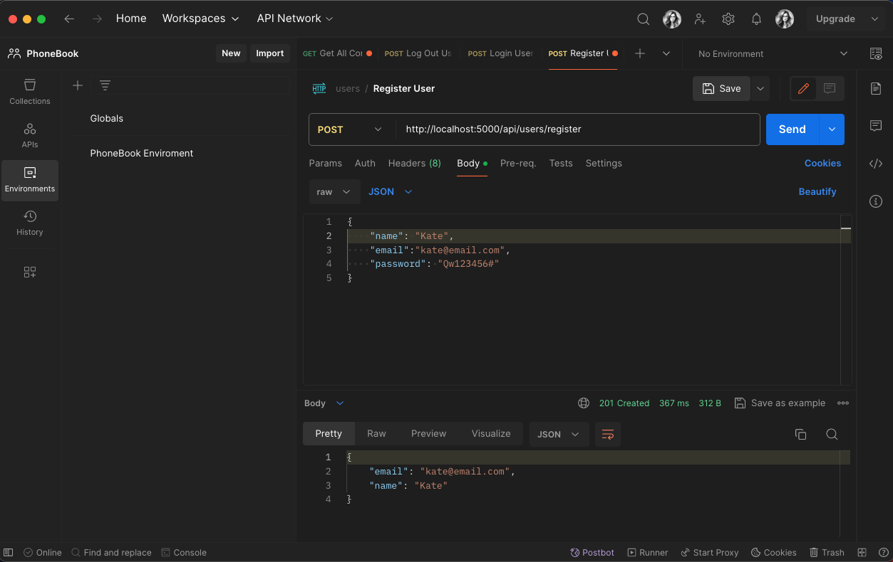
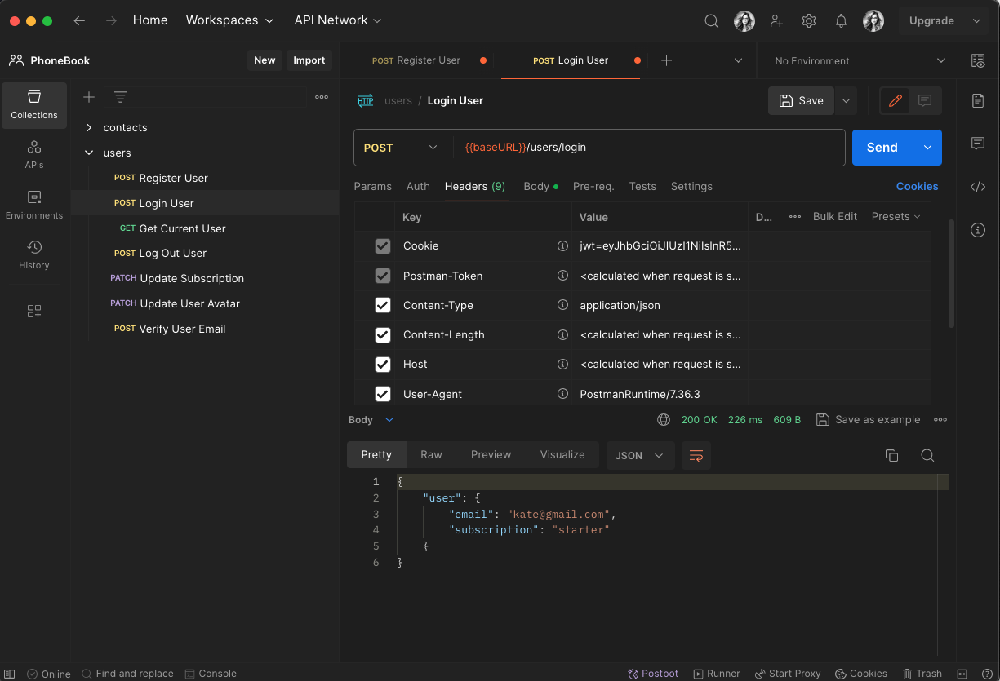
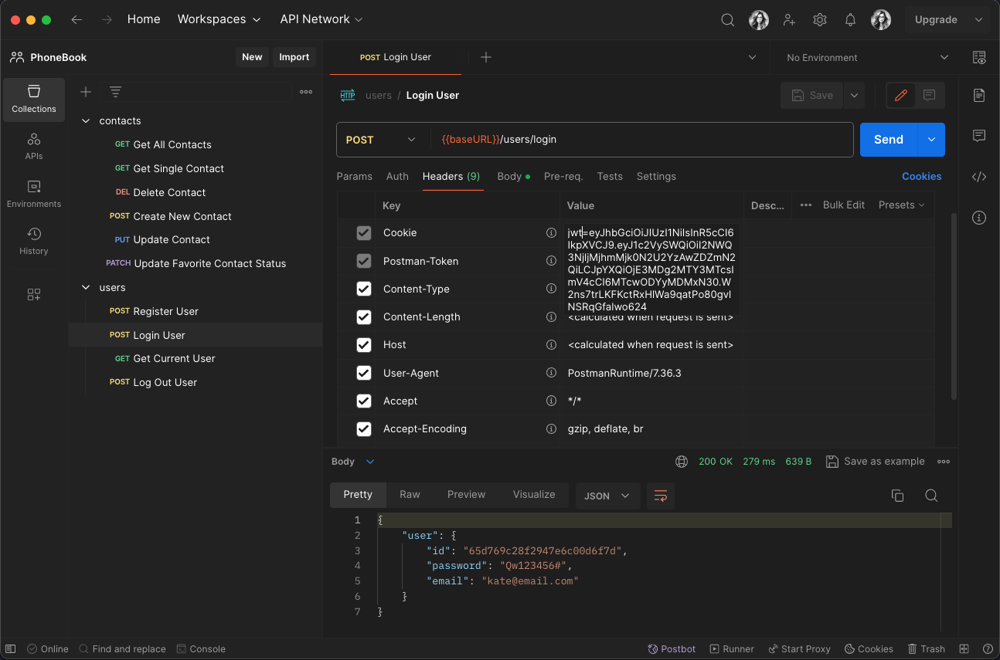
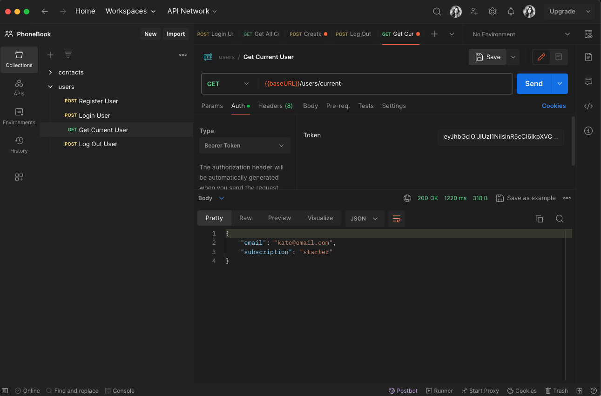
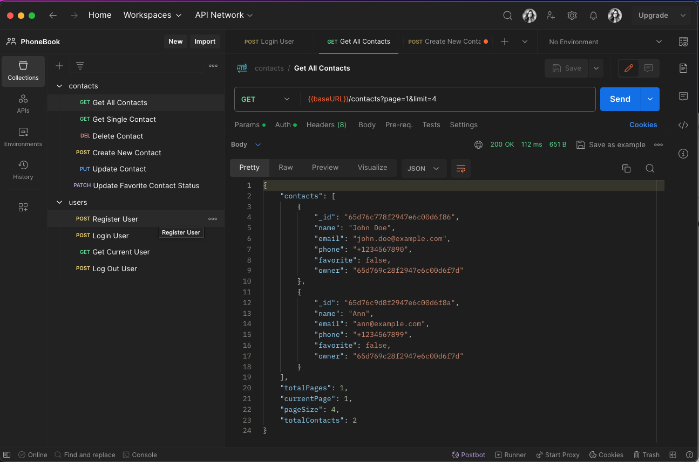
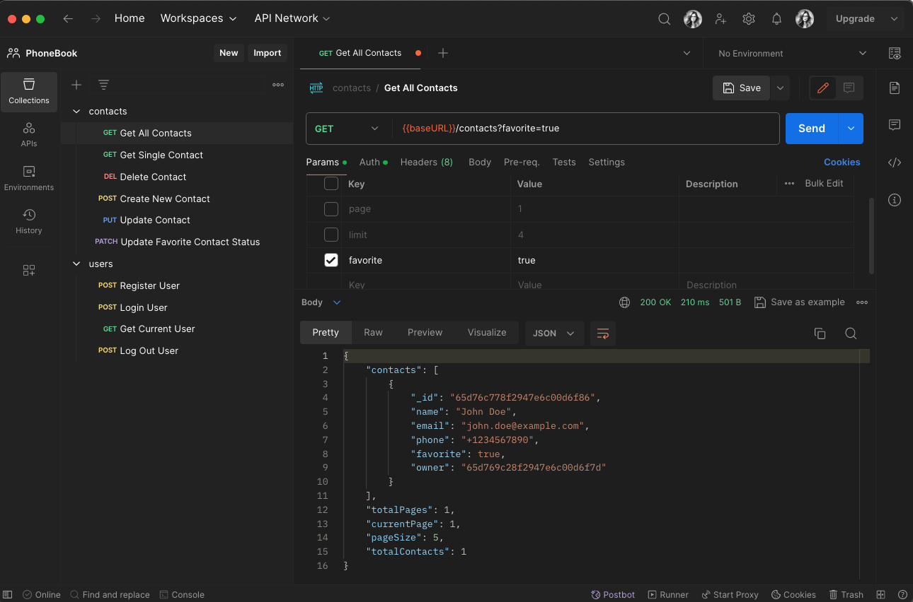
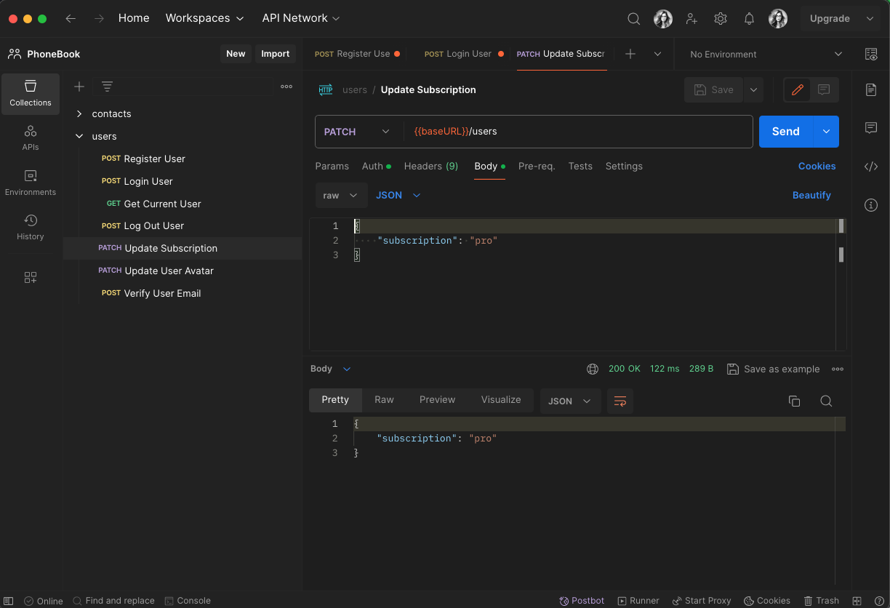

# Authentication

## Description

This assignment provides detailed instructions for developing a REST API with
authentication and authorization of users through JWT (JSON Web Tokens). The
described process includes creating models for users and contacts, implementing
registration, login, logout, token verification, and retrieving user data.

## API Endpoints

- Registration `POST /api/users/register`

Validate all mandatory fields (email and password). Return a validation error if
validation fails.

On successful validation, create a user with the validated data. Use bcrypt or
bcryptjs for password hashing.

If the email is already in use, return a Conflict error. Otherwise, return a
successful response.

- Login `POST /api/users/login`

Find the user by email and validate mandatory fields. Return a validation error
if any fails.

Store the JWT in an HTTP Only Cookie.

- Logout `POST /api/users/logout`

- Current User Data `GET /api/users/current`

- Implement pagination for the contacts collection

  `GET/contacts?page=1&limit=5`

- Implemented filtering of contacts by the favorite field

  `GET api/contacts?favorite=true`

- Allow updating the user's subscription

  `PATCH /users`

subscription should be one of ['starter', 'pro', 'business'].

- Token Verification

Implement middleware for token verification and add it to all routes that need
to be protected.

The middleware should take the token from the Authorization headers, verify it,
and, if valid, retrieve the user's id from the token to find the user in the
database. If the user exists and the token matches, proceed with the request.

## Usage

Use Postman to test the API endpoints by sending requests to
http://localhost:5000/api/

## License

[MIT](https://choosealicense.com/licenses/mit/)
