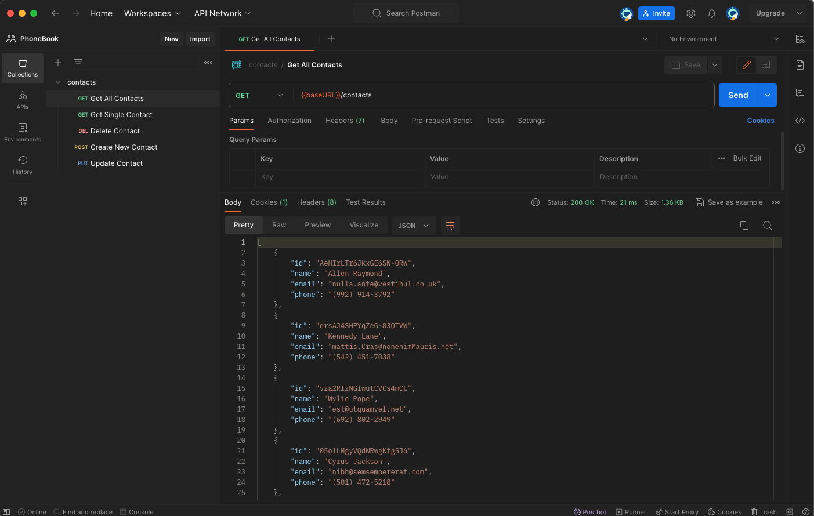
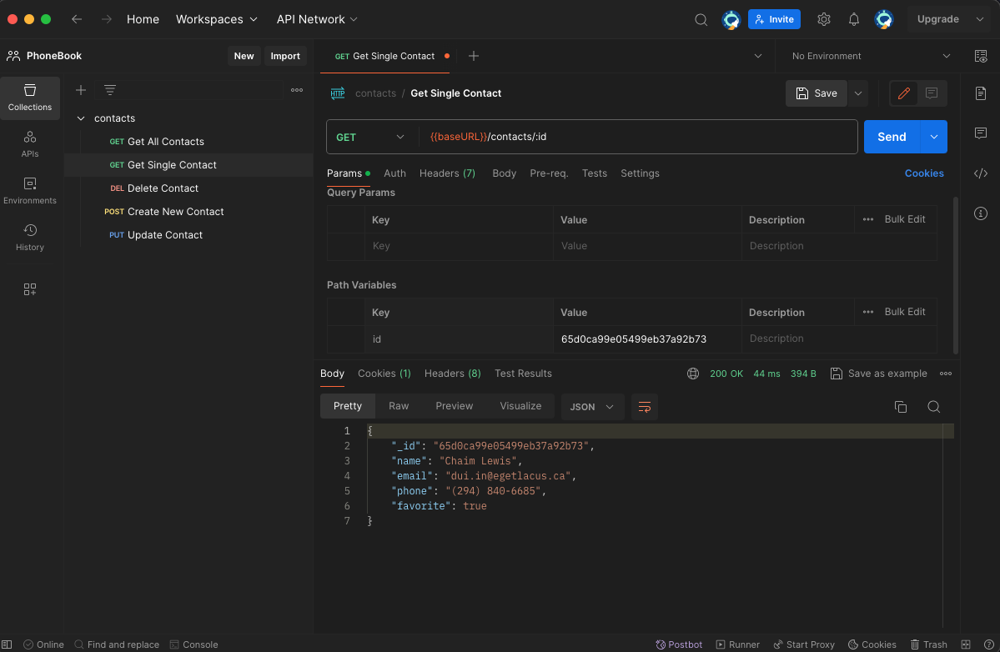
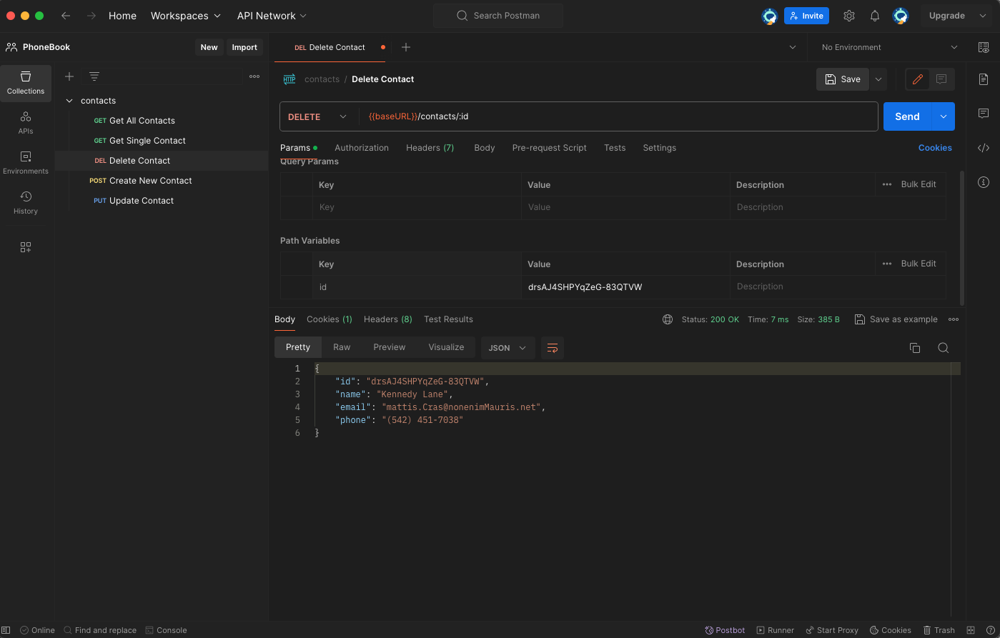
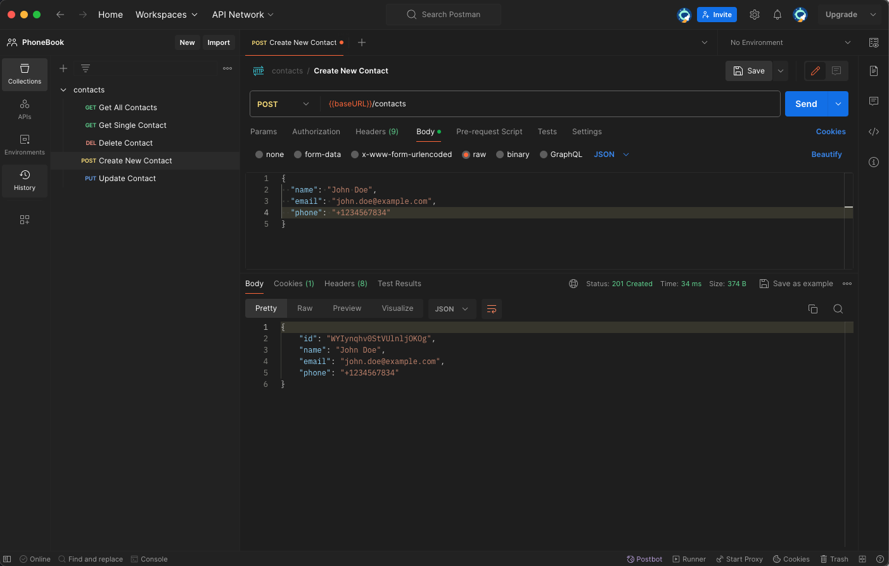
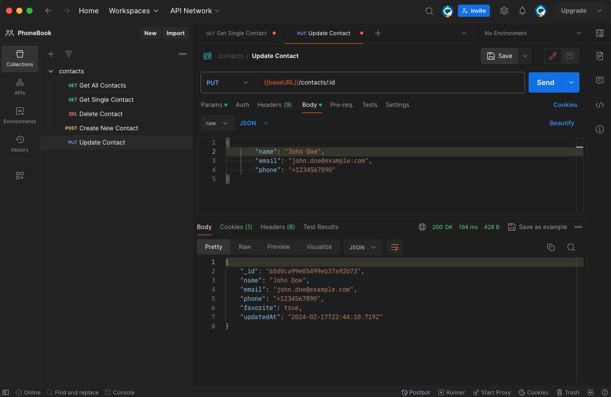

# MongoDB Mongoose connection

## Description

This repository contains the second homework assignment for building a REST API
for managing a contacts collection. The API supports CRUD operations on a simple
contacts database stored in JSON format.

## API Endpoints

- List all contacts `GET /api/contacts`

- Get a contact by ID `GET /api/contacts/:id`

- Delete a contact `DELETE /api/contacts/:id`

- Add a new contact `POST /api/contacts`

- Update a contact `PUT /api/contacts/:id`

- Update a contact `PATCH/api/contacts/:id/favorite`

## Usage

Use Postman to test the API endpoints by sending requests to
https://phonebook-backend-mongodb.onrender.com/api/contacts

## License

[MIT](https://choosealicense.com/licenses/mit/)

# Notice

## Методы Mongoose

#### Поиск всех документов

- `Model.find()`

  без условий, будут возвращены все документы из коллекции

- `Model.find({}, 'name email')`

  Вернутся только поля name и email для каждого документ

- `Model.find({}, '-name -email')`

  Вернутся все поля кроме name email

- `Model.find()`

  `.where('age').gt(18)` Больше 18

  `.limit(10)` Вернуть максимум 10 документов

  `.sort({ name: 1 })` Сортировка по полю name в алфавитном порядке

  `.select('name age')` Вернуть только поля name и age

#### Для поиска одного элемента по его идентификатору id

- Model.findById(id)

#### Обновление по id

`Model.findByIdAndUpdate(id, update, options, callback)`

В данном случае, Model.findByIdAndUpdate(id, req.body, { new: true }) делает
следующее:

- id: Идентификатор документа, который нужно найти и обновить.

- req.body: Объект с изменениями, которые должны быть применены к документу.
  Этот объект содержит поля и значения, которые вы хотите обновить.

- { new: true }: Опция, которая указывает, что метод должен вернуть обновленный
  документ. Если опция установлена в false или опущена, метод вернет
  оригинальный документ до применения обновления.

#### Удаление по id

`Model.findByIdAndDelete(id)`

Возвращаемое значение — это документ, который был удален, или null, если
документ с указанным идентификатором не найден.
