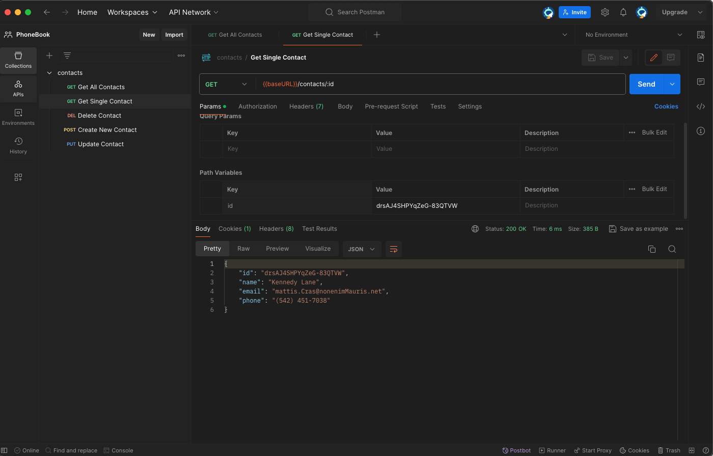

# node-rest-api

## Description

This repository contains the second homework assignment for building a REST API
for managing a contacts collection. The API supports CRUD operations on a simple
contacts database stored in JSON format.

## API Endpoints

- List all contacts `GET /api/contacts`

- Get a contact by ID `GET /api/contacts/:id`

- Delete a contact `DELETE /api/contacts/:id`

- Add a new contact `POST /api/contacts`

- Update a contact `PUT /api/contacts/:id`

## Usage

Use Postman to test the API endpoints by sending requests to
http://localhost:5000/api/contacts.

## Validation

Validation of request bodies is performed using Joi. Ensure that your request
data matches the schema requirements for each endpoint.

## Error Handling

The API uses custom error handling middleware to manage responses for invalid
requests or when resources are not found.

## License

[MIT](https://choosealicense.com/licenses/mit/)
