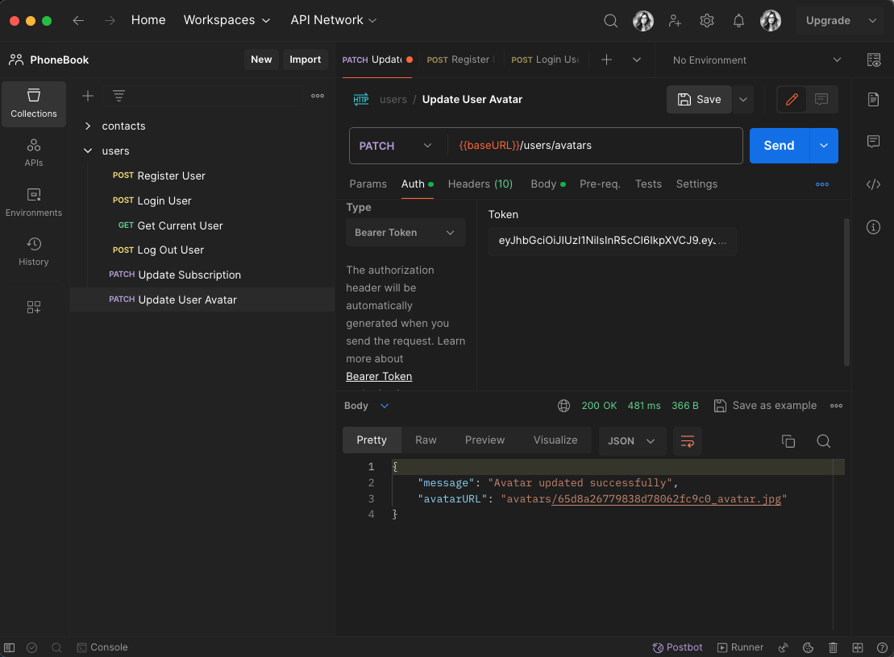

# Branch auth

## Description

This assignment provides detailed instructions for developing a REST API with
authentication and authorization of users through JWT (JSON Web Tokens). The
described process includes creating models for users and contacts, implementing
registration, login, logout, token verification, and retrieving user data.

## API Endpoints

- Registration `POST /api/users/register`

Validate all mandatory fields (email and password). Return a validation error if
validation fails.

On successful validation, create a user with the validated data. Use bcrypt or
bcryptjs for password hashing.

If the email is already in use, return a Conflict error. Otherwise, return a
successful response.

- Login `POST /api/users/login`

Find the user by email and validate mandatory fields. Return a validation error
if any fails.

Store the JWT in an HTTP Only Cookie.

- Logout `POST /api/users/logout`

- Current User Data `GET /api/users/current`

- Implement pagination for the contacts collection

  `GET/contacts?page=1&limit=5`

- Implemented filtering of contacts by the favorite field

  `GET api/contacts?favorite=true`

- Allow updating the user's subscription

  `PATCH /users`

subscription should be one of ['starter', 'pro', 'business'].

- Token Verification

Implement middleware for token verification and add it to all routes that need
to be protected.

The middleware should take the token from the Authorization headers, verify it,
and, if valid, retrieve the user's id from the token to find the user in the
database. If the user exists and the token matches, proceed with the request.

# Branch avatars

Used multipart/form-data for file upload.

Updated the user's avatarURL field with the obtained URL.

## API Endpoint

- Updating user avatars `PATCH /api/users/avatars`

---

Processed the uploaded avatar to resize it to 250x250 using the `jimp` package.

Saved the user's avatar with a unique name in the public/avatars folder.

# Branch mongodb

## Description

This repository contains the second homework assignment for building a REST API
for managing a contacts collection. The API supports CRUD operations on a simple
contacts database stored in JSON format.

## API Endpoints

- List all contacts `GET /api/contacts`

- Get a contact by ID `GET /api/contacts/:id`

- Delete a contact `DELETE /api/contacts/:id`

- Add a new contact `POST /api/contacts`

- Update a contact `PUT /api/contacts/:id`

- Update a contact `PATCH/api/contacts/:id/favorite`

# Branch email

Added user email verification after registration using the
[SendGrid](https://sendgrid.com/) service.

You can use [TempMail](https://temp-mail.org/) to check it out.

## How the verification process works

- After registration, the user receives a letter to the e-mail address specified
  during registration with a link to verify his email.

User will not be able to log in without email confirmation

- After following the link in the received letter, for the first time, the user
  receives

  status 200 `Email confirmed successfully`

- After following the link again, the user receives an Error with the status

  404 `Email not found`

## API Endpoints

- Verification request `GET /users/verify/:verificationCode`

- Resend Verification request `POST /users/verify `

Adding a resending email to the user with a link for verification

## Dockerfile

## Usage

Use Postman to test the API endpoints by sending requests to
https://phonebook-backend-mongodb.onrender.com

## License

[MIT](https://choosealicense.com/licenses/mit/)
